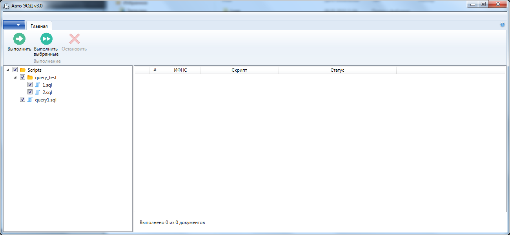
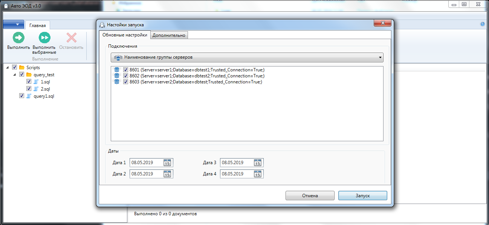

# AutoEod3

## Описание
Автоматическое выполнение sql-скриптов на базах данных Microsoft SQL Server. Скрипты могут выполняться паралельно, на разных sql серверах и разных базах данных.

## Установка, настройка
* Настройка файла `Connections.xml`:
```xml
<?xml version="1.0" encoding="utf-8" ?>
<root>
    <connections name="Наименование группы серверов">
        <connection connectionString="Server=server1;Database=db_test1;Trusted_Connection=True;" description="8601" index="01" />
      <connection connectionString="Server=server1;Database=db_test2;Trusted_Connection=True;" description="8602" index="02" />
      <connection connectionString="Server=server2;Database=db_test;Trusted_Connection=True;" description="8603" index="03" />
    </connections> 
    <connections name="Наименование группы серверов 2">        
      <connection connectionString="Server=server5;Database=db_test;Trusted_Connection=True;" description="8603" index="03" />
    </connections>   
</root>
```

## Измнения
* 30.10.2018 - создание

## Нужно доработать
* 30.10.2018 - ПРОБЛЕМА! Разобраться с повторной отменой (видимо проблема в потоках)
* 30.10.2018 - В строки в результате добавить таймер отсчета повторного выполнения
* 08.05.2019 - Ошибка с кодировкой (при загрузке и сохранении)
* 08.05.2019 - Сделать выгрузку в Excel
* 08.05.2019 - Сделать выгрузку в 1 файл всех результатов
* 08.05.2019 - Возникает исключение при запуске по таймеру

## Снимки экрана

